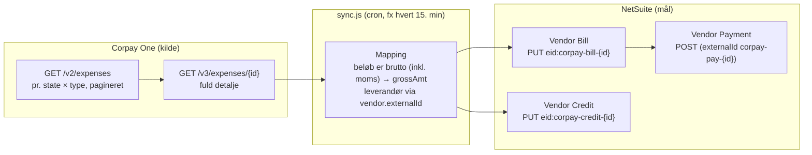
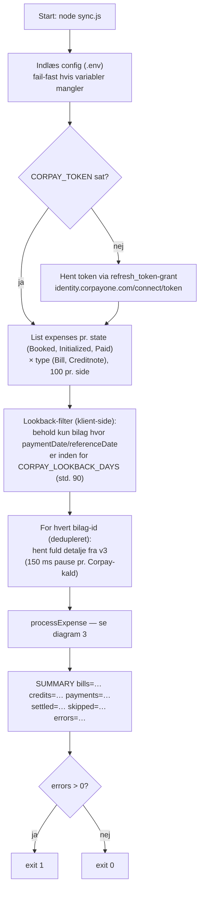
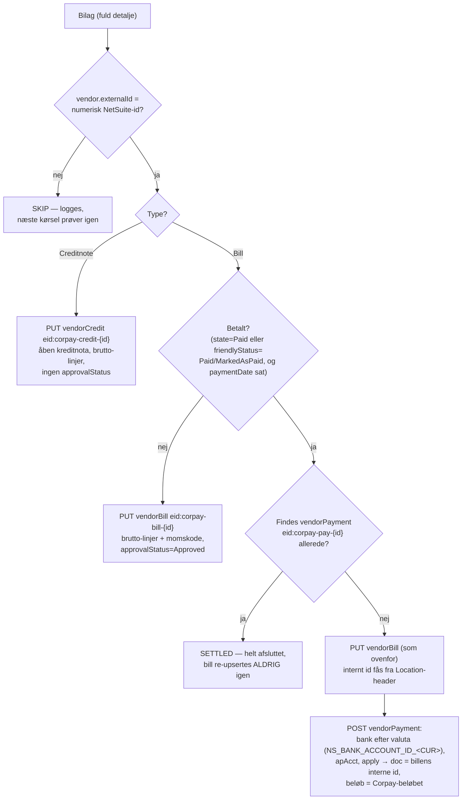

# Flow: Corpay One → NetSuite

Sådan virker `sync.js`. Én kørsel (`node sync.js`) skubber regninger (Vendor Bill), kreditnotaer (Vendor Credit) og betalinger (Vendor Payment) fra Corpay One til NetSuite og stopper. Al idempotens ligger i NetSuites `externalId` — ingen lokal database.

## 1. Arkitektur

## 2. Én kørsel

Fejl på ét bilag stopper aldrig kørslen — de logges som `ERROR <kind> <id>` og tælles. Næste kørsel prøver igen (upserts er ufarlige at gentage).

## 3. Pr. bilag (processExpense)

## 4. Nøgler og idempotens

| Corpay | NetSuite-record | externalId | Opdateres? |
|---|---|---|---|
| Bill | Vendor Bill | `corpay-bill-{id}` | Ja, upsert hver kørsel — indtil den er betalt (SETTLED) |
| Creditnote | Vendor Credit | `corpay-credit-{id}` | Ja, upsert hver kørsel |
| Betalt Bill | Vendor Payment | `corpay-pay-{id}` | Nej — oprettes én gang, røres aldrig igen |

- **Brutto-beløb:** Corpays beløb er inkl. moms. Linjer sendes som `grossAmt`, så NetSuite selv beregner netto/moms ud fra momskoden — bill-total = Corpay-beløb = betaling. Regningen lukkes helt.
- **Selvhelende:** Check/VCC-flows (friendlyStatus `CheckIssued`/`VccIssued`) får deres betaling, når Corpay skifter state til `Paid` — polling samler den op i en senere kørsel.
- **Genstart ufarlig:** afbrudt kørsel efterlader højst en bill uden betaling; næste kørsel opretter betalingen.

## Virker det?

Verificeret offline: `npm test` (stub'et Corpay + NetSuite, ingen netværk) dækker upsert-URL'er, brutto-beløb, 45-tegns trunkering af fakturanr., SKIP ved manglende leverandør-stempling, SETTLED-spring, lookback-filteret og en uafhængig efterregning af OAuth-signaturen. Mangler før produktion: en live røgtest mod Corpay staging + NetSuite sandbox med rigtige nøgler (formular-obligatoriske felter kan ikke ses via API'et).
