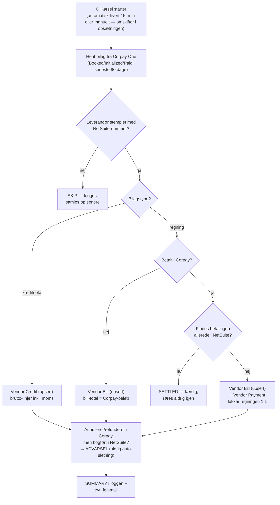

# Corpay One → NetSuite — one-pager

**Hvad:** Envejs-synkronisering der automatisk bogfører Corpay One-bilag i NetSuite:
regninger → **Vendor Bill**, kreditnotaer → **Vendor Credit**, betalinger → **Vendor Payment** (lukker regningen).

**Hvordan:** Et lille program kører med faste mellemrum (eller når du trykker på knappen), henter nye/ændrede bilag fra Corpay og bogfører dem i NetSuite. Ingen database — al hukommelse ligger i NetSuite via faste nøgler (`corpay-bill-{id}` m.fl.), så genkørsler aldrig kan skabe dubletter.

## Flowchart

## Sikkerhedsnet ("må ikke fejle")

| Garanti | Hvordan |
|---|---|
| Aldrig dubletter | Fast nøgle pr. bilag i NetSuite; genkørsel opdaterer, opretter aldrig igen |
| Beløb stemmer altid | Bruttobeløb (inkl. moms) → bill-total = Corpay-beløb = betaling. Splits der ikke summer korrekt bookes som én samlelinje med advarsel |
| Færdigt er færdigt | Betalt regning + betaling røres aldrig igen (SETTLED) |
| Én fejl vælter ikke læsset | Fejl pr. bilag logges og prøves igen næste kørsel; token fornys automatisk; netværksfejl retries |
| Intet slettes i smug | Annullerede/refunderede bilag giver en advarsel til manuel håndtering |

## To måder at køre den på — samme logik, samme nøgler

| | **GitHub Actions** (`sync.js`) | **Inde i NetSuite** (`netsuite/`) |
|---|---|---|
| Kører hvor | GitHubs sky | NetSuites egen scheduler |
| Auto/manuel-omskifter | Variablen `SYNC_ENABLED` / "Run workflow"-knap | Deployment-status `Scheduled` / `Not Scheduled` + "Save & Execute" |
| Nøgler bor | GitHub Secrets | Kundens NetSuite (krypteret API Secret) |
| Bedst til | Central drift hos Omnit | "Alt hos kunden", ingen egen infrastruktur |

Varianterne er ombyttelige (samme nøgler) — men kør aldrig begge samtidig.

## Før go-live (pr. kunde)

1. **Corpay API-adgang** (klient + team-id) og **NetSuite-nøgler** (TBA/integration record)
2. **Stempl leverandørerne** i Corpay med deres NetSuite-numre (engangsjob)
3. **Vælg kontering**: subsidiary, kreditor- og bankkonto, standard-udgiftskonto, momskoder (evt. pr. valuta)
4. **Én røgtest i sandbox**, start i manuel tilstand — slå automatikken til, når posteringerne lander rigtigt
