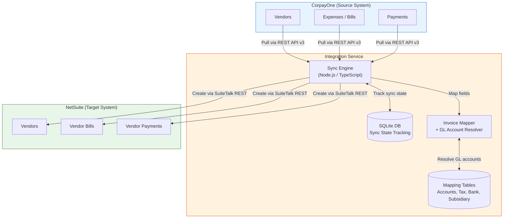
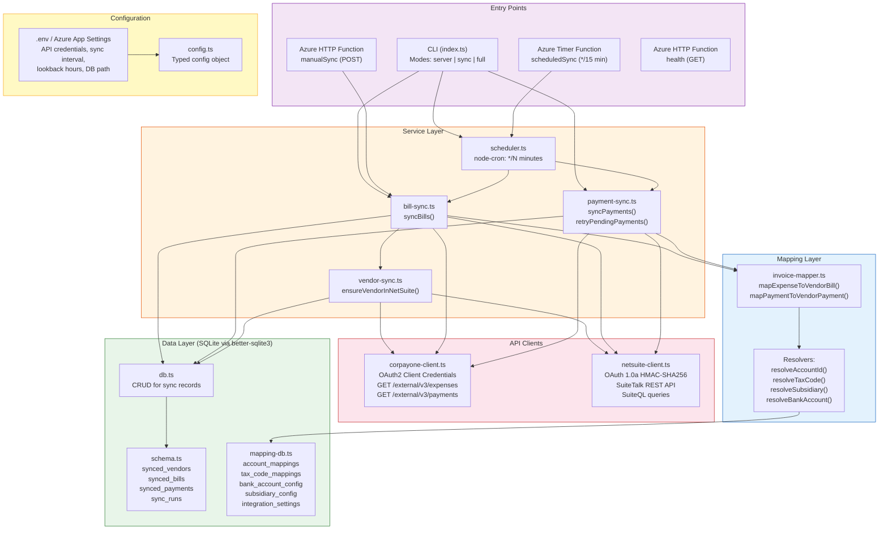
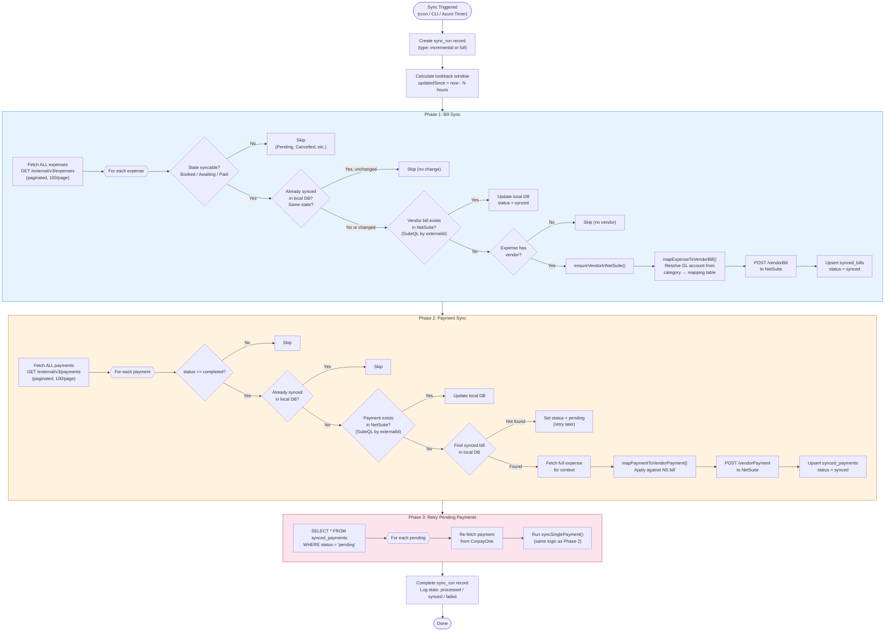
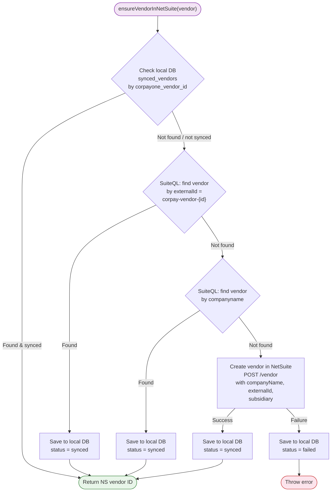
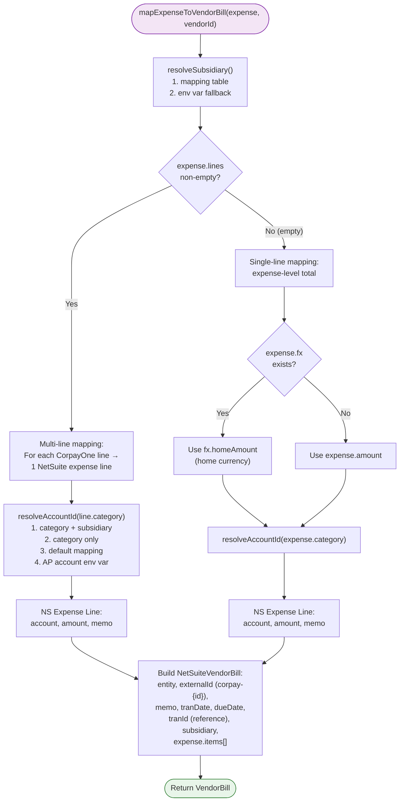
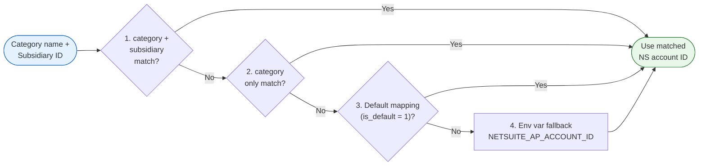
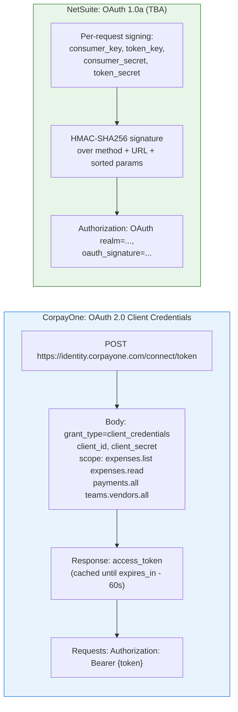
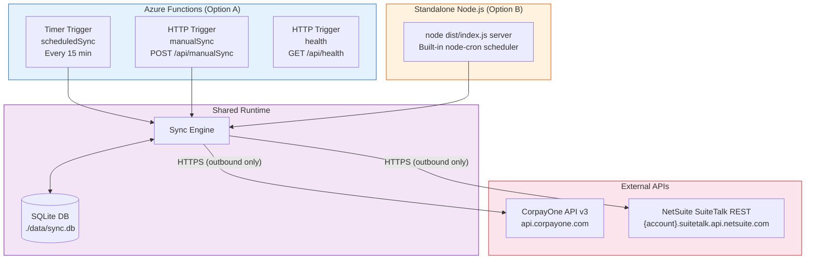

# CorpayOne → NetSuite Integration: Architecture Diagrams

## 1. High-Level Functional Overview

## 2. Technical Architecture & Components

## 3. Complete Sync Cycle Flow (Scheduled / Incremental)

## 4. Vendor Resolution Flow

## 5. Invoice Mapping: CorpayOne Expense → NetSuite Vendor Bill

## 6. GL Account Resolution (Fallback Chain)

## 7. Authentication Flows

## 8. Deployment Architecture

## Data Flow Summary

| Step | Source | Action | Target |
|------|--------|--------|--------|
| 1 | CorpayOne | Pull expenses (paginated) | Integration Service |
| 2 | Integration | Filter: Booked/Awaiting/Paid only | - |
| 3 | Integration | Check dedup (local DB + NetSuite) | SQLite + NetSuite |
| 4 | Integration | Resolve/create vendor | NetSuite |
| 5 | Integration | Map expense → vendor bill | - |
| 6 | Integration | Create vendor bill | NetSuite |
| 7 | CorpayOne | Pull payments (paginated) | Integration Service |
| 8 | Integration | Match payment → synced bill | SQLite |
| 9 | Integration | Create vendor payment (applied to bill) | NetSuite |
| 10 | Integration | Retry any pending payments | NetSuite |
