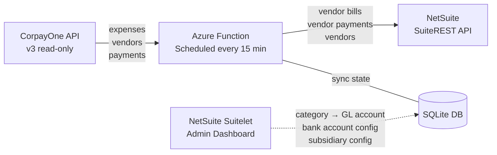
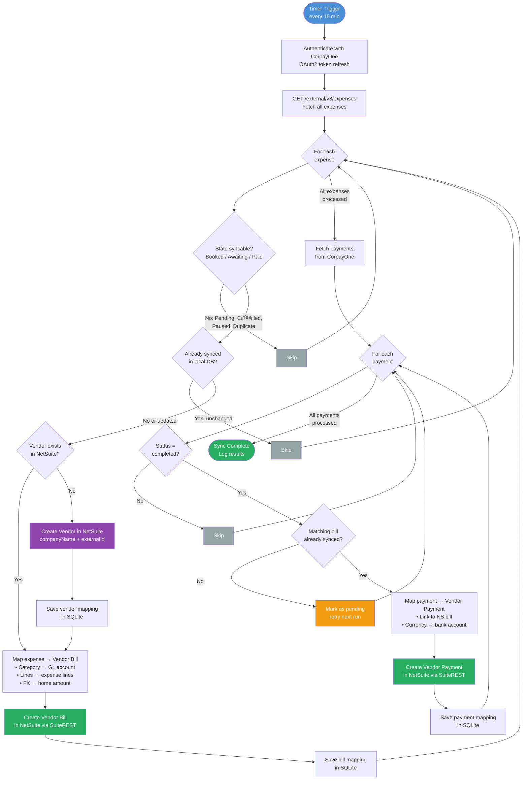
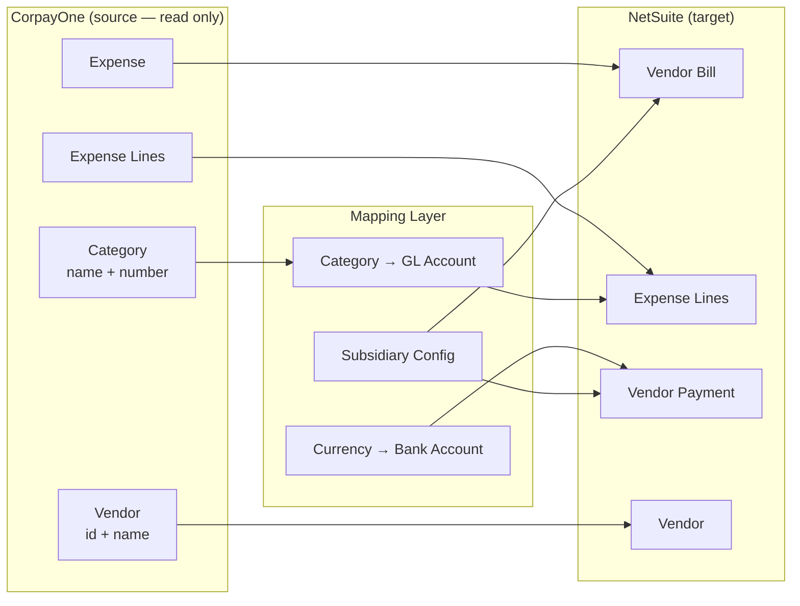
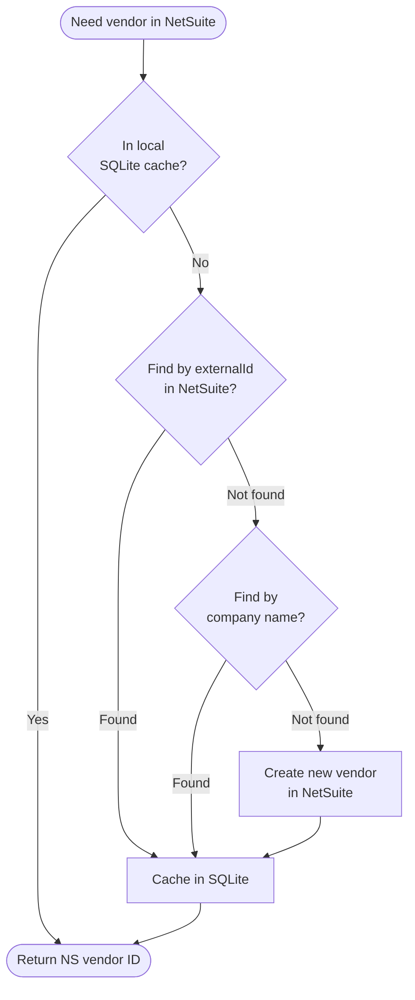

# CorpayOne → NetSuite Integration Flow

## High-Level Overview



---

## Detailed Sync Flow



---

## Data Mapping



---

## Vendor Lookup Logic



---

## Architecture

```
┌─────────────────────────────────────────────────────────┐
│                    Azure Function                        │
│                  (Timer: every 15 min)                    │
│                                                          │
│  ┌─────────────┐   ┌──────────────┐   ┌──────────────┐ │
│  │  CorpayOne   │   │   Mapping    │   │   NetSuite   │ │
│  │   Client     │   │   Engine     │   │   Client     │ │
│  │             │   │              │   │              │ │
│  │ • getExpenses│   │ • category   │   │ • createBill │ │
│  │ • getPayments│   │   → GL acct  │   │ • createPay  │ │
│  │             │   │ • lines      │   │ • upsertVend │ │
│  │  OAuth2     │   │ • FX convert │   │  TBA OAuth1  │ │
│  └──────┬──────┘   └──────┬───────┘   └──────┬───────┘ │
│         │                 │                   │         │
│         └────────┬────────┘───────────────────┘         │
│                  │                                       │
│          ┌───────┴───────┐                               │
│          │   SQLite DB   │                               │
│          │               │                               │
│          │ • synced_bills│                               │
│          │ • synced_pays │                               │
│          │ • synced_vend │                               │
│          │ • sync_runs   │                               │
│          └───────────────┘                               │
└─────────────────────────────────────────────────────────┘

         ▲ READ only                    WRITE ▼
         │                              │
┌────────┴─────────┐          ┌────────┴──────────┐
│   CorpayOne API  │          │   NetSuite REST   │
│   v3 /expenses   │          │   SuiteREST API   │
└──────────────────┘          └───────────────────┘
```

---

## Key Design Decisions

| Decision | Why |
|---|---|
| **One-way sync** (CorpayOne → NetSuite) | CorpayOne is the source of truth for AP. NetSuite is the ERP target. |
| **Pull-based, no webhooks** | No open endpoints needed. Simpler security. Runs inside Azure VNET. |
| **SQLite for sync state** | Local to the function. No external DB dependency. Fast. |
| **Idempotent** | Every record gets an `externalId` (e.g. `corpay-exp-1001`). If it exists in NetSuite, skip. |
| **Category → GL account mapping** | Configured by admin in NetSuite Suitelet. Not hardcoded. |
| **Multi-line support** | If expense has lines → one NS line per CorpayOne line. If not → single line from total. |
| **No VAT from API** | CorpayOne v3 API has no VAT breakdown. Tax codes applied by NetSuite rules. |
| **Pending payment retry** | If a payment arrives before its bill is synced, mark pending. Retry next cycle. |
